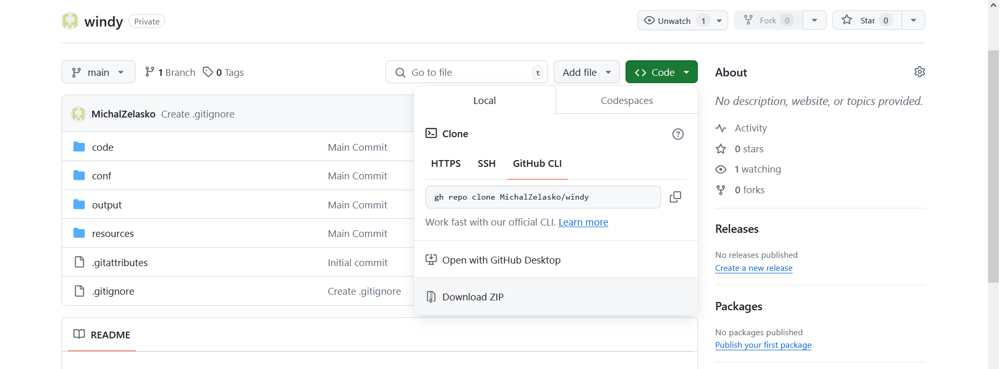
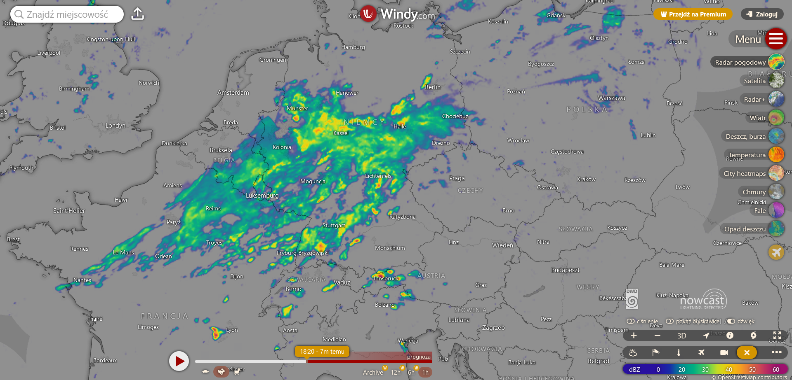
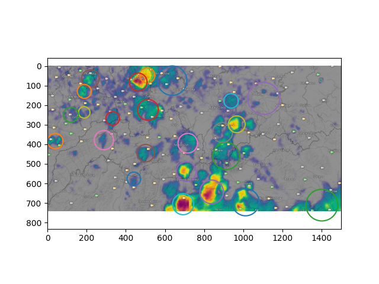
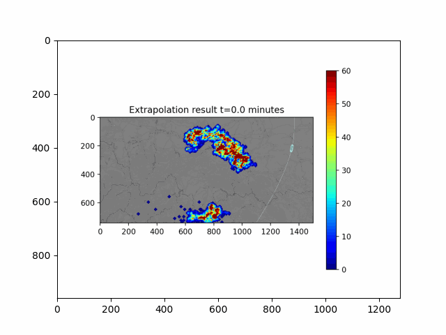
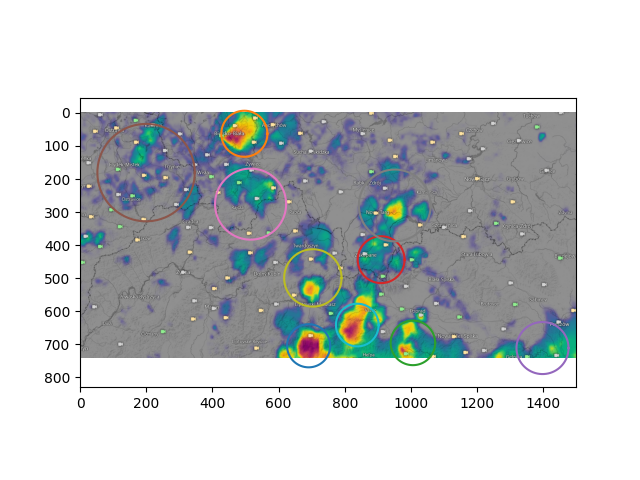
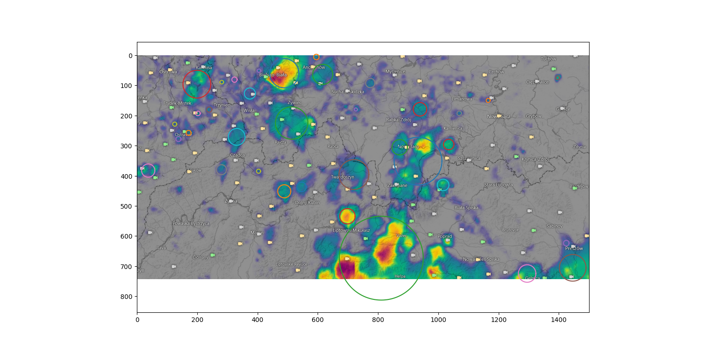
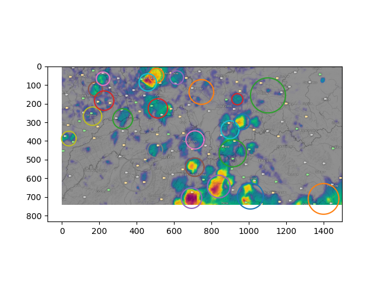
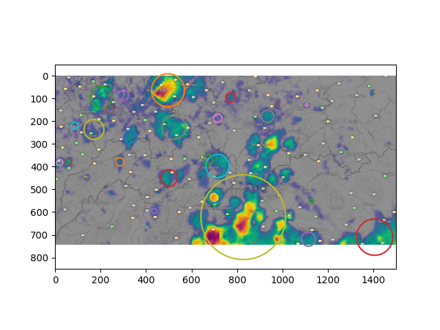
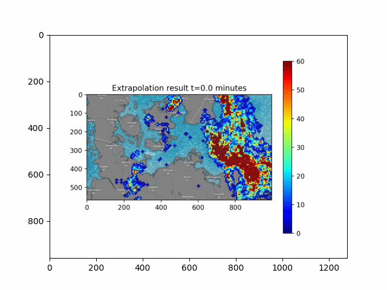
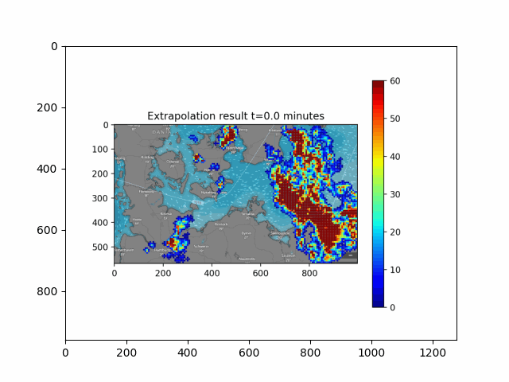

# Description - EN

## Installation

To install the application, download the code from github (as a ZIP archive) and then unpack it locally.



Alternatively, you can download the contents of the entire repository using the command line using the command:

```
gh repo clone MichalZelasko/windy
```

### Requirements

The software was written in Python, so it is necessary to install the current version of the interpreter on your computer. The next step necessary to run the application is to install/update the libraries.

```
pip install -r requirements.txt
```

### Launch

The application can be launched after going to the ./code directory and by using the command:

```
python app.py
```

## Description

The purpose of the application is to enable prediction of the development of storm clouds based on data from the precipitation radar from the website: https://www.windy.com. The program downloads data from the specified url address (a map representing current precipitation in the selected area), based on which information is obtained about the location, area and intensity of precipitation in the last hour (in the form of precipitation maps for several time steps).



In the next stage, the precipitation is divided into clusters (clouds, storm cells) for which their exact location, size and intensity of precipitation are determined. Performing such a division for each photo allows determining the history of precipitation development.



Based on the collected information, the change in the location, size and intensity of precipitation in individual clouds is extrapolated. The application then visualizes the predictions (in the form of animations in .gif format and graphs presenting the values ​​of individual characteristic features of clusters). In order to obtain a realistic background for the animation, you should also indicate the URL of the website with the map as the background.



A configuration file is used to control the parameters of clustering, extrapolation and visualization. This allows the selection of the clustering and extrapolation method (details in the **Configuration** section).

### Converter

The captured images contain elements of the website that make interpretation difficult (logo, menu legend), so the area of ​​the image must be limited (the parameters of this process are configurable, fields: *x_a*, *x_b*, *y_a*, *y_b* in the configuration file, default values ​​*None* mean that the program will automatically select the width of the margins to remove unnecessary elements of the website). The converted files will then be transferred to the specified directory.

### Cloud extraction

In order to obtain quantitative data on the intensity of precipitation based on color maps, unnecessary elements are removed from the image (e.g.: webcam symbols), areas where precipitation occurs are selected, the color scale is converted to the intensity of precipitation, edges are removed (city names, edges of symbols). At this stage, precipitation is represented as a set of points with coordinates and the intensity of precipitation assigned to them.

### Clustering

The next stage is grouping points into clusters representing precipitation zones (individual clouds, storm cells). Before the actual clustering, a subset of points is drawn (with probability proportional to the intensity of precipitation - weight). The percentage of points that will be in the final subset can be set using the *prob* parameter in the configuration file. This allows for taking into account the intensity of precipitation when detecting storm cells and separating subareas with increased intensity from large areas of precipitation.

**Methods**

Various clustering methods were used to cluster the set of points, the method can be selected via the configuration file:

1. KMeans - the classic kmeans method with a hyperparameter k - representing the number of clusters. The elbow method is used to determine this parameter (the scope of the study can be configured using the parameters *elbow_start*, *elbow_stop*, *elbow_step*). The number of clusters determined using the elbow method is used for the final division of the point set.

2. DBSCAN - DBSCAN method from the **scikit-learn** library, using the configuration file you can set the *eps* parameter (https://scikit-learn.org/stable/modules/generated/sklearn.cluster.DBSCAN.html).

3. Mixed method - (own study) a method consisting in running the DBSCAN method to determine the number and location of cluster centers, which are used to initialize the KMEANS method.

4. Hierarchical method - (own work) method consisting in alternating and hierarchical division of the data set using KMEANS methods (number of clusters configurable using *n_clusters*) and DBSCAN, the parameter *kmeans_first* decides which method is used first. The parameter *clusterize_depth* decides the number of division layers.


### Storm development history
Clustering is performed for each map, then for each cluster its ancestor is determined (cluster on the map representing the previous time step, which is closest). On this basis, a cloud development history graph is created.

### Extrapolation
For each cluster its attributes are determined:
* x, y coordinates,
* total rainfall intensity in the cluster (power),
* cluster size relative to directions (this allows to approximate the shape of the cloud using a polygon).
Using the history of changes in the values ​​of the features of individual clusters (determined based on the features of predecessors in the cloud development history graph), it is possible to extrapolate the values ​​of these attributes. The exact time range for which extrapolation is performed can be set using the fields *extr_stop* - end of extrapolation in minutes and *extr_step* - time step with which subsequent frames in the animation will be generated.

**Methods**

The following methods were used for extrapolation:

1. Linear regression - implementation from the scikit-learn library (https://scikit-learn.org/stable/modules/generated/sklearn.linear_model.LinearRegression.html).

2. Barycentric interpolation - BarycentricInterpolator class from the scipy library (https://docs.scipy.org/doc/scipy/reference/generated/scipy.interpolate.BarycentricInterpolator.html).

3. Spline interpolation - make_interp_spline method from the scipy library (https://docs.scipy.org/doc/scipy/reference/generated/scipy.interpolate.make_interp_spline.html).

4. Cubic spline interpolation - CubicSpline class from scipy library (https://docs.scipy.org/doc/scipy/reference/generated/scipy.interpolate.CubicSpline.html).
5. Interp1d method from scipy library.
6. Approximation methods (implementation using scipy):
   * linear function approximation,
   * quadratic function approximation,
   * polynomial approximation,
   * polynomial quotient approximation.

Linear regression extrapolation animation:


Polynomial ratio extrapolation animation:


### Visualization and animation

The basic animation includes a presentation of the extrapolated precipitation development in the form of a .gif file using the *jet* color scale from the Matplotlib library. Individual frames of the animation are created by plotting points that are part of clusters (shifted according to the displacement and change in cluster size). It is assumed that the distance of a given point from the cluster's center of gravity changes proportionally to the cluster size (the shift of the cluster's center results from extrapolation and the general tendency for clouds to move, the relationship between these shifts is defined by the *move_coeff* parameter). The intensity of rainfall at a given point depends proportionally to the extrapolated cluster power (power) and inversely proportionally to the square of the cluster size (we treat the cluster power as an integral of the rainfall intensity, therefore the increase in the area occupied by the cluster must be associated with an inversely proportional decrease in the rainfall intensity at individual points). Additionally, the parameter *t_ceoff* was introduced - representing the suppression of storm development over time (value 0 - means that the rainfall intensity over time does not decrease relative to the extrapolated value, value 1 - means that the rainfall disappears after 100 minutes - short-term storm rainfall). The celluloid 0.2.0 library (https://github.com/jwkvam/celluloid) was used to construct the animation.

Additionally, as part of the visualization, you can configure the ability to create drawings showing:
* division of input maps into clusters,
* values ​​of extrapolated quantities for individual clusters,
* a graph of the dependence of clustering quality on the number of clusters for the elbow method,
* a directed graph (DAG) of cluster evolution,
* the location of clusters during extrapolation.

## Configuration

The configuration file ("./conf/coonf.json") allows you to adjust the parameters controlling the application's operation to your needs. The following variables can be modified:

* "screenshoot" - parameters configuring taking screenshots:
  - "do_screenshot": true | **false** - whether to take screenshots from the https://www.windy.com/pl/-Radar-pogodowy-radar?radar portal,
  - "url": **"https://www.windy.com/pl/-Radar-pogodowy-radar?radar,54.632,13.964,7,m:e02agSR"** - url address from which precipitation maps are downloaded,
  - "url_map": **"https://www.windy.com/pl/-Fale-waves?waves,2024072615,54.632,13.964,7,i:pressure,m:e02agSR"** - url address from which an empty map (background) is downloaded,
  - "delay_1": int | float (default: **10**) - delay value after which the animation starts on the website from the browser window appearing,
  - "delay_2": int | float (default: **4**) - delay value from the animation start to the first screenshot,
  - "screenshot_number": int (default: **10**) - number of screenshots taken,
  - "screenshot_time": int | float (default: **7**) - time to take all screenshots,
  - "do_convert": true | **false** - whether to convert files from the *resource* directory.

* "filepaths" - paths to files and directories:
  - "resource": "../resources/raw_picture" - path to the directory with website screenshots,
  - "path": "../resources/pictures" - path to the directory with converted files,
  - "map": "../resources/maps/Map_tmp.png" - path to the file containing the map constituting the background of the animation (.png extension),
  - "animation": "../output/animation_4.gif" - path to the file being the animation presenting the results of precipitation development extrapolation (.gif extension).

* "picture_setting" - parameters controlling the conversion of screenshots to the form used by the animation:
  - "grey_difference": int (default: **32**) - maximum difference between individual RGB components so that the pixel is evaluated as gray (not representing the intensity of precipitation),
  - "image_size": int (default: **1920**) - image size,
  - "x_a": **null** | int - top margin,
  - "x_b": **null** | int - bottom margin,
  - "y_a": **null** | int - left margin,
  - "y_b": **null** | int - right margin.

* "colormap" - parameters controlling the detection of precipitation zones and determining their intensity:
  - "step_1": 20,
  - "step_2": 40,
  - "step_3": 60,
  - "half_way": 30.

* "sampling" - parameterization of sampling a set of points:
  - "prob": float (default: **0.1**) - fraction of the number of points taken into account for clustering,
  - "scale": float (default: **300**) - scale (the actual scale is calculated as scale / image_size).

* "cluster" - parameters controlling the clustering process (detection of rain/storm zones):
  - "elbow_start": int (default: **2**) - the smallest number of clusters analyzed in the elbow method,
  - "elbow_stop": int (default: **50**) - the largest number of clusters analyzed in the elbow method,
  - "elbow_step": int (default: **4**) - step in the elbow method,
  - "eps_coeff": float (default: **1.41**) - *eps* coefficient in the DBSCAN method,
  - "mixed_coeff": (default: **1.41**) - 1 / *mixed_coeff* means the fraction (in the *mixed* method) of the number of clusters indicated by the DBSCAN method, with the help of which the KMeans method is initialized,
  - "clusterize_depth": int (default: **4**) - depth of the tree in the division into clusters using the hierarchical method,
  - "kmeans_first": **true** | false - when using the *hierarchical* method, information whether the KMeans method is used first,
  - "n_clusters": int (default: **2**) - number of clusters into which the subset of points is divided in the hierarchical method at the stage using the KMeans method,
  - "option_clust": **"mixed"** | "kmeans" | "dbscan" | "hierarchical" - clustering method.

* "extrapolation" - parameters controlling the extrapolation process:
  - "option_pos": **"linear"** | "noncubic" | "slinear" | "quadratic" | "cubic" | "cubicspline" | "polynomial" | "aproximation" - a method of extrapolating the positions of the cluster centers of gravity,
  - "option": **"linear"** | "noncubic" | "cubicspline" | "polynomial" | "aproximation" - a method of extrapolating the strength (power) of clusters and their size,
  - "k": int (default: **3**) - approximation for extrapolation using Taylor series expansion,
  - "func": **"hyperbolic"** | "linear" | "square" | "polynomial" | "division" | "taylor" - type of function used when selecting the *aproximation* option,
  - "extr_stop": int (default: **60**) - maximum time for which extrapolation is performed,
  - "extr_step": int (default: **2**) - time step - after how many minutes the map showing the extrapolation of precipitation is performed.

* "visualization" - parameters controlling the visualization process:
  - "do_draw_clusters": true | **false** - whether to visualize clusters on input maps,
  - "do_draw_elbow_graph": true | **false** - whether to show a graph showing the quality of clustering in the elbow method,
  - "do_draw_graph": true | **false** - whether to visualize a graph of relations between clusters,
  - "do_draw_cluster_centers": true | **false** - whether to plot the cluster locations on the extrapolation map,
  - "do_plot_extrapolation": true | **false** - whether to visualize extrapolation results (features of individual clusters) as graphs,
  - "move_coeff": float (default: **0.75**) - weight of the extrapolation result in relation to the general displacement (wind) when calculating the position of individual points,
  - "vis_coeff": int (default: **1**) - coefficient defining the density of points in the animation (1 - maximum density),
  - "t_coeff": float (default: **0.25**) - coefficient of precipitation decay (value 0 - means that the intensity of precipitation does not decrease over time relative to the extrapolated value, value 1 - means that the precipitation decays after 100 minutes - short-term storm precipitation).

# Opis - PL

## Instalacja

W celu instalacji aplikacji należy pobrać kod z serwisu github (w postaci archiwum ZIP), a następnie lokalnie rozpakować.


Alternatywnie można pobrać zawartość całego repozytorium za pomocą linii komend wykorzystując polecenie:

```
gh repo clone MichalZelasko/windy
```

### Wymagania

Oprogramowanie zostało napisane w pythonie, dlatego niezbędne jest zainstalowanie na komputerze aktualnej wesji interpretera. Kolejnym krokiem niezbędnym do uruchomienia aplikacji jest instalacja/uaktualnienie bibliotek. 

```
pip install -r requirements.txt
```

### Uruchomienie

Aplikację można uruchomić po przejściu do katalogu ./code z pomocą polecenia:

```
python app.py
```

## Opis

Celem aplikacji jest umożliwienie prowadzenia predykcji rozwoju chmur burzowych na podstawie danych z radaru opadów ze strony: https://www.windy.com. Program pobiera dane ze wskazanego adresu url (mapa reprezentująca aktualne opady na wybranym obszarze) na podstawie, których uzyskiwane są informacje o położeniu, obszarze i intensywności opadów w ciągu ostatniej godziny (w postaci map opadów dla kilku kroków czasowych).


W kolejnym etapie następuje podział opadów na klastry (chmury, komórki burzowe) dla ktorych określane jest ich dokładne położenie, rozmiar i intensywność opadów. Wykonanie takiego podziału dla każdego zdjęcia pozwala okreslić historię rozwoju opadów. 


Na podstawie zebranych informacji ekstrapolowana jest zmiana położenia, rozmiaru i intensywności opadów w poszczególnych chmurach. Aplikacja następnie dokonuje wizualizacji wykonanych predykcji (w postaci animacji w formacie .gif i wykresów przedstawiających wartości poszczególnych cech charaktestycznych klastrów). W celu uzyskania realistycznego tła dla animacji należy wskazać również adres url strony internetowej z mapą stanowiącą tło.


Do sterowania parametrami klasteryzacji, ekstrapolacji i wizualizacji wykorzystywany jest plik konfiguracyjny. Umożliwia to między innymi wybór metody klasteryzacji i ekstrapolacji (szczegóły w sekcji **Configuration**).

### Zrzuty ekranu

Pierwszy etap działania aplikacji opiera się na wykonaniu screenshotów podanej w pliku konfiguracyjnym strony internetowej zawierającym mapę opadów z wykorzystaniem biblioteki Selenium (https://selenium-python.readthedocs.io/). Po uruchomieniu programu pojawi się okno przeglądarki ze stroną internetową: https://www.windy.com/pl/-Radar-pogodowy-radar?radar. Jeśli pojawi się zapytanie o akceptację plików cookie należy wybrać dowolną opcję umożliwiającą przejście do właświej strony. Aplikacja automatycznie uruchomi animację na stronie internetowej i wykona zdjęcia strony internetowej. Następnie okno przeglądarki zniknie i proces powtórzy się dla procesu pobrania tła (pustej mapy). Odpowiednie adresy internetowe należy wprowadzić w pliku konfiguracyjnym (./conf/conf.json). W pliku można również ustalić wartości opóźnień dla poszczególnych etapów procesu wykonywania zrzutów ekranu (można je modyfikować w zależności od szybkości internetu - szczegóły w sekcji **Configuration**). 

### Converter

Wykonane zdjęcia zawierają elementy strony internetowej utrudniające interpretację (logo, menu legenda), dlatego obszar zdjęcia musi zostać ograniczony (parametry tego procesu są konfigurowalne, pola: *x_a*, *x_b*, *y_a*, *y_b* w pliku konfiguracyjnym, wartości domyślne *None* oznaczają, że program automatycznie dobierze szerkość marginesów tak by usunąć niepotrzebne elementy strony internetowej). Skonwertowane pliki zostaną następnie przeniesione do wskazanego katalogu.

### Cloud extraction

W celu uzyskania danych ilościowych o intensywności opadów na podstawie map barwnych następuje usunięcie niepotrzebnych elementów ze zdjęcia (np.: symbole kamer internetowych), selekcja obszarów, na których występują opady, przeliczenie skali barwnej na intensywność opadów, usunięcie krawędzi (nazwy miast, krawędzie symboli). Na tym etapie opady reprezentowane są jako zbiór punktów posiadających współrzędne oraz przypisaną im intensywność opadów.

### Klasteryzacja

Kolejnym etapem jest grupowanie punktów w klastry reprezentujących strefy opadów (poszczególne chmury, komórki burzowe). Przed właściwą klasteryzacją następuje wylosowanie podzbioru punktów (z prawdopodobieństwem proporcjonalnym do intensywności opadów - wagi). Procent punktów, które znajdą się w końcowym podzbiorze można ustawić za pomocą parametru *prob* w plicku konfiguracyjnym. Pozwala to na uwzględnienie intensywności opadów przy wykrywaniu komórek burzowych i wydzielenie z dużych obszarów opadów podobszarów o zwiększonej intensywności.

**Metody**

Do klasteryzacji zbioru punktów wykorzystano różne metody klasteryzacji, wyboru metody można dokonać poprzez plik konfiguracyjny:

1. KMeans - klasyczna metoda kmeans z hiperparamtrem k - reprezentującym liczbę klastrów. Do ustalenia tego parametru wykorzystywana jest metoda łokciowa (zakres badania można konfigurować za pomocą parametrów *elbow_start*, *elbow_stop*, *elbow_step*). Wyznaczona za pomocą metody łokciowej liczbę klastrów wykorzystuje się do ostatecznego podziału zbioru punktów.

2. DBSCAN - metoda DBSCAN z biblioteki **scikit-learn**, za pomocą pliku konfiguracyjnego można ustalić parametr *eps* (https://scikit-learn.org/stable/modules/generated/sklearn.cluster.DBSCAN.html).

3. Metoda mieszana - (opracowanie własne) metoda polegająca na uruchomieniu metody DBSCAN w celu wyznaczenia liczby i położenia centrów klastrów, które wykorzystywane są do inicjalizacji metody KMEANS.

4. Metoda hierarchiczna - (opracowanie własne) metoda polegająca na naprzemiennym i hierarchicznym podziale zbioru zbioru danych za pomocą metod KMEANS (liczba klastrów konfigurowalna za pomocą *n_clusters*) i DBSCAN, o tym która metoda jest wykorzystywana jako pierwsza decyduje parametr *kmeans_first*. O liczbie warstw podziałów decyduje parametr *clusterize_depth*.


### Historia rozwoju burz
Klasteryzacja prowadzona jest dla każdej mapy, następnie dla każdego klastra wyznaczany jest jego przodek (cluster na mapie reprezentujących poprzedni krok czasowy, który leży najbliżej). Na tej podstawie powstaje graf historii rozwoju chmur.

### Ekstrapolacja
Dla każdego klastra określane są jego atrybuty:
* współrzędne x, y,
* sumaryczna intensywność opadów w klastrze (mocy - power),
* rozmiar klastra względem kierunków (pozwala to na przybliżenie kształtu chmury za pomocą wielokątu).
Wykorzystując historię zmiany wartości cech poszczególnych klastrów (wyznaczoną po podstawie cech poprzedników w grafie historii rozwoju chmur) można dokonać ekstrapolacji wartości tych atrybutów. Dokładny zakres czasów, dla których wykonana jest ekstrapolacja można ustawić za pomocą pól *extr_stop* - koniec ekstrapolacji w minutach i *extr_step* - krok czasowy z jakim generowane będę kolejne klatki w animacji.

**Metody**

Do ekstrapolacji wykorzystano następujące metody:
1. Regresja liniowa - implementacja z biblioteki scikit-learn (https://scikit-learn.org/stable/modules/generated/sklearn.linear_model.LinearRegression.html).
2. Interpolacja barycentryczna - klasa BarycentricInterpolator z biblioteki scipy (https://docs.scipy.org/doc/scipy/reference/generated/scipy.interpolate.BarycentricInterpolator.html).
3. Interpolacja spline'ami - metoda make_interp_spline z biblioteki scipy (https://docs.scipy.org/doc/scipy/reference/generated/scipy.interpolate.make_interp_spline.html).
4. Interpolacja spline'ami kubicznymi - klasa CubicSpline z biblioteki scipy (https://docs.scipy.org/doc/scipy/reference/generated/scipy.interpolate.CubicSpline.html).
5. Metoda interp1d z biblioteki scipy.
6. Metody aproksymacyjne (implementacja z wykorzystaniem scipy):
    * aproksymacja funckją liniową,
    * aproksymacja funckją kwadratową,
    * aproksymacja wielomianowa,
    * aproksymacja poprzez iloraz wielomianów.

Animacja ekstrapoloacji z wykorzystaniem regresji liniowej:


Animacja ekstrapoloacji z wykorzystaniem ilorazu wielomianów:


### Wizualizacja i animacja

Podstawowa animacja obejmuje przedstawienie wyekstrapolowanego rozwoju opadów w postaci pliku .gif z wykorzystaniem skali barwnej *jet* z bilioteki Matplotlib. Poszczególne klatki animacji powstają poprzez naniesienie punktów wchodzących w skład klastrów (przesuniętych zgodnie z przemieszczeniem i zmianą rozmiaru klastrów). Przyjęto, że odległość danego punktu od środka ciężkości klastra zmienia się proporcjonalnie do rozmiaru klastra (przesunięcię środka klastra wynika z ekstrapolacji i ogólnej tendencji do przemieszczania się chmur, relacja pomiędzy tymi przesunięciami definiowana jest poprzez parametr *move_coeff*). Intensywność opadów w danym punkcie zależy proporcjonalnie do wyekstrapolowanej mocy klastra (power) i odwrotnie proporcjonalnie do kwadratu rozmiaru klastra (moc klastra trakujemy jako całkę do intensywności opadów, dlatego wzrost obszaru zajmowanego przez klaster musi wiązać się z odwrotnie proporcjonalnym spadkiem intensywności opadów w poszczególnych punktach). Dodatkowo wprowadzono parametr *t_ceoff* - reprezentujący tłumienie rozwoju burz w czasie (wartość 0 - oznacza, że intensywność opadu w czasie nie ulega spadkowi względem wartości wyekstrapolaowanej, wartość 1 - ozancza, że opad zanika po 100 minutach - krótkotrwały opad burzowy). Do konstruowania animacji wykorzystano bibliotekę celluloid 0.2.0 (https://github.com/jwkvam/celluloid).

Dodatkowo w ramach wizualizacji można skonfigurować możliwość tworzenia rysunków przedstawiających:
* podział wejściowych map na klastry, 
* wartości ekstrapolowanych wielkości dla poszczególnych klastrów,
* wykres zależności jakości klasteryzacji od liczby klastrów dla metody łokciowej, 
* graf skierowany (DAG) ewolucji klastrów, 
* położenie klastrów w trakcie ekstrapolacji.

## Konfiguracja

Plik konfiguracyjny ("./conf/coonf.json") umożliwia dopasowanie parametrów sterujących działaniem aplikacji do potrzeb. Modyfikowane mogą być następujące zmienne:

* "screenshoot" - parametry konfigurujące wykonywanie zrzutów ekranu:
    - "do_screenshot": true | **false** - czy wykonywać zrzuty ekranu z portalu https://www.windy.com/pl/-Radar-pogodowy-radar?radar,
    - "url": **"https://www.windy.com/pl/-Radar-pogodowy-radar?radar,54.632,13.964,7,m:e02agSR"** - adres url, z którego pobierane są mapy opadów,
    - "url_map": **"https://www.windy.com/pl/-Fale-waves?waves,2024072615,54.632,13.964,7,i:pressure,m:e02agSR"** - adres url, z którego pobierana jest pusta mapa (tło),
    - "delay_1": int | float (default: **10**) - wartość opóźnienia, po którym następuje uruchomienie animacji na stronie internetowej od pojawienia się okna przeglądarki,
    - "delay_2": int | float (default: **4**) - wartość opóźnienia od uruchomienia animacji do wykonania pierwszego zrzutu ekranu,
    - "screenshot_number": int (default: **10**) - liczba wykonywanych zrzutów ekranu,
    - "screenshot_time": int | float (default: **7**) - czas na wykonanie wszystkich zrzutów ekranów,
    - "do_convert": true | **false** - czy wykonywać konwersję plików z katalogu *resource*.

* "filepaths" - ścieżki do plików i katalogów:
    - "resource": "../resources/raw_picture" - ścieżka do katalogu ze screenshotami strony internetowej,
    - "path": "../resources/pictures" - ścieżka do katalogu ze skonwertowanymi plikami,
    - "map": "../resources/maps/Map_tmp.png" - ścieżka do pliku zawierającego mapę stanowiącą tło animacji (rozszerzenie .png),
    - "animation": "../output/animation_4.gif" - ścieżka do pliku będącego animację przedstawiąjącą wyniki ekstrapolacji rozwoju opadów (rozszerzenie .gif).

* "picture_setting" - parametry sterujące konwertowaniem screenshotów do formy wykorzystywanej przez animację:
    - "grey_difference": int (default: **32**) - maksymalna różnica pomiędzy poszczególnymi składowymi RGB tak by piksel został oceniony jako szary (nie reprezentujący intensywności opadu),
    - "image_size": int (default: **1920**) - rozmiar obrazu,
    - "x_a": **null** | int - górny margines,
    - "x_b": **null** | int - dolny margines,
    - "y_a": **null** | int - lewy margines,
    - "y_b": **null** | int - prawy margines.

* "colormap" - parametry sterujące wykrywaniem stref opadów i określeniem ich intensywności:
    - "step_1": 20,
    - "step_2": 40,
    - "step_3": 60,
    - "half_way": 30.

* "sampling" - parametryzacja próbkowania zbioru punktów:
    - "prob": float (default: **0.1**) - ułamek liczby punktów uwzględnianych przy klasteryzacji,
    - "scale": float (default: **300**) - skala (właściwa skala oblicza jako scale / image_size).

* "cluster" - parametry sterujące procesem klasteryzacji (wykrywania strefopadów/burz):
    - "elbow_start": int (default: **2**) - najmniejsza liczba klastrów analizowana w ramach metody łokciowej,
    - "elbow_stop": int (default: **50**) - największa liczba klastrów analizowana w ramach metody łokciowej,
    - "elbow_step": int (default: **4**) - krok w metodzie łokciowej,
    - "eps_coeff": float (default: **1.41**) - współczynnik *eps* w metodzie DBSCAN,
    - "mixed_coeff": (default: **1.41**) - 1 / *mixed_coeff* oznacza ułamek (w metodzie *mixed*) liczby klastrów wskazanych przez metodę DBSCAN, za pomocą których inicjalizowana jest metoda KMeans,
    - "clusterize_depth": int (default: **4**) - głębokość drzewa w podziale na klastry za pomocą metody hierarchicznej,
    - "kmeans_first": **true** | false - przy zastosowaniu metody *hierarchical* informacja czy metoda KMeans jest wykorzystywana jako pierwsza,
    - "n_clusters": int (default: **2**) - liczba klastrów, na które dzielony jest podzbiór punktów w metodzie hierarchicznej na etapie wykorzystującym metodę KMeans,
    - "option_clust": **"mixed"** | "kmeans" | "dbscan" | "hierarchical" - metoda klasteryzacji.

* "extrapolation" - parametry sterujące procesem ekstrapolacji:
    - "option_pos": **"linear"** | "noncubic" | "slinear" | "quadratic" | "cubic" | "cubicspline" | "polynomial" | "aproximation" - sposób ekstrapolacji pozycji środków ciężkości klastrów, 
    - "option": **"linear"** | "noncubic" | "cubicspline" | "polynomial" | "aproximation" - sposób ekstrapolacji siły (power) klastrów i ich rozmiaru, 
    - "k": int (default: **3**) - przybliżenie przy ekstrapolacji z pomocą rozwinięcia w szereg Taylora, 
    - "func": **"hyperbolic"** | "linear" | "square" | "polynomial" | "division" | "taylor" - rodzaj funkcji wykorzystywanej przy wybraniu opcji *aproximation*,
    - "extr_stop": int (default: **60**) - maksymalny czas, dla którego wykonywana jest ekstrapolocja,
    - "extr_step": int (default: **2**) - krok czasowy - co ile minut wykonywana jest mapa przedstawiająca ekstrapolację opadów.

* "visualization" - parametry sterujące procesem wizualizacji:
    - "do_draw_clusters": true | **false** - czy wizualizować klastry na mapach wejściowych,
    - "do_draw_elbow_graph": true | **false** - czy pokazać wykres przedstawiający jakość klasteryzacji w metodzie łokciowej,
    - "do_draw_graph": true | **false** - czy wizualizować graf relacji pomiędzy klastrami,
    - "do_draw_cluster_centers": true | **false** - czy nanosić na mapę ekstrapolacji położenia klastrów,
    - "do_plot_extrapolation": true | **false** - czy wizualizować w postaci wykresów wyniki ekstrpolacji (cechy poszczególnych klastrów),
    - "move_coeff": float (default: **0.75**) - waga wyniku ekstrapolacji w stosunku do ogólnego przemiszczenia (wiatr) przy obliczaniu położenia poszczeólnych punktów,
    - "vis_coeff": int (default: **1**) - współczynnik określający zagęszczenie punktów na animacji (1 - gęstość maksymalna),
    - "t_coeff": float (default: **0.25**) - współczynnik zanikania opadów (wartość 0 - oznacza, że intensywność opadu w czasie nie ulega spadkowi względem wartości wyekstrapolaowanej, wartość 1 - ozancza, że opad zanika po 100 minutach - krótkotrwały opad burzowy).